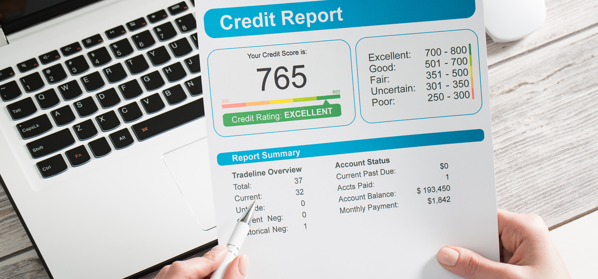
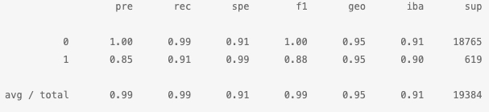
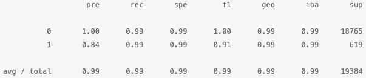

# Credit Risk Analysis Machine-Learning Model

## Overview of the Analysis

 Healthy loans typically outnumber risky loans, so we will create a `Logicistic Regression` model with our original data and compare that with a resampled training data that uses `RandomOverSampler`.  The following machine-learning model will allow users to use various techniques to train and evaluate models with imbalanced classes.  From a dataset of historical lending activity, we will build a model that will help us identify healthy loans vs. high-risk loans. 

  > **[Logistic Regression](https://towardsdatascience.com/logistic-regression-detailed-overview-46c4da4303bc)** - uses a categorical dependent variable to help predict an outcome from a sample of data it is provided.

We will use the following financial information:

* Loan Size
* Interest Rate
* Borrower Income
* Debt to Income
* Number of Accounts
* Derogatory Marks
* Total Debt
* Loan Status

Based on the total sample of `healthy loan` `0` vs `high-risk loan` `1`, our model will help us predict whether an applicant is a high-risk or not.  The total sample size for each will help us determine our model's accuracy.

To help us test the accuracy of our prediction, we will use `LogisticRegression` and `Resampling`.  For both methods, we will get a count of each target class.  You will notice that in the original dataset, there is an imbalance of total number of support between `0` and `1`.  We will then train both methods with a logistic regression classifier, calculate their balanced accuracy score, generate a confusion matrix and finally generate a classification report.  At the end, we will compare the classification report from the original dataset to the resampling-oversampler dataset.

## Results

Let's take a look at our results:
  
- **Accuracy** = estimates the accuracy of the model.
- **Precision** = measures our confidence that the model correctly made the positive predictions.
- **Recall** = measures our confidence that the model correctly predicted a negative prediction.

Machine Learning Model 1 - Original Data:

  * Balanced Accuracy - At 95%, the balanced accuracy is fairly high.
  * Precision - Healthy loans 100% which means predicted data for healthy loans is accurate.  However, high-risk loans is at 85% accuracy.
  * Recall - The healthy loans 99% recall accuracy is also high with high-risk loans at 91%.

Machine Learning Model 2 - Over Sampler:

  * Balanced Accuracy - Using the resampling-oversampler method, the balanced accuracy increases from 95% to 99%.
  * Precision - The healthy loans stays at 100%, while high-risk loans slightly decrease to 84%.
  * Recall - The healthy loans accuracy percentage remains at 99%, while high-risk loans greatly increases to 99% accuracy.

## Summary

The Resampling Oversampler method appears to perform the best as you will see an increase in the balanced accuracy and recall accuracy from original data vs. resampling oversampler.  Based on our initial `value_counts`, we immediately noticed a difference between the support provided for healthy loans vs. high risk loans.  We also know because healthy loans outnumber risky loans, our accuracy on predicting either category would not be as accurate for predicting high-risk loans as it would be for predicting healthy loans.  By using the oversampling method, we helped balance the support data to help improve our model's prediction.
